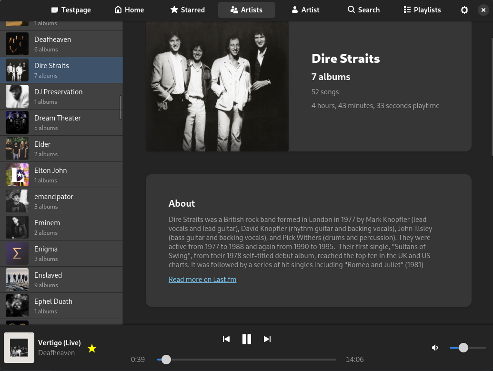
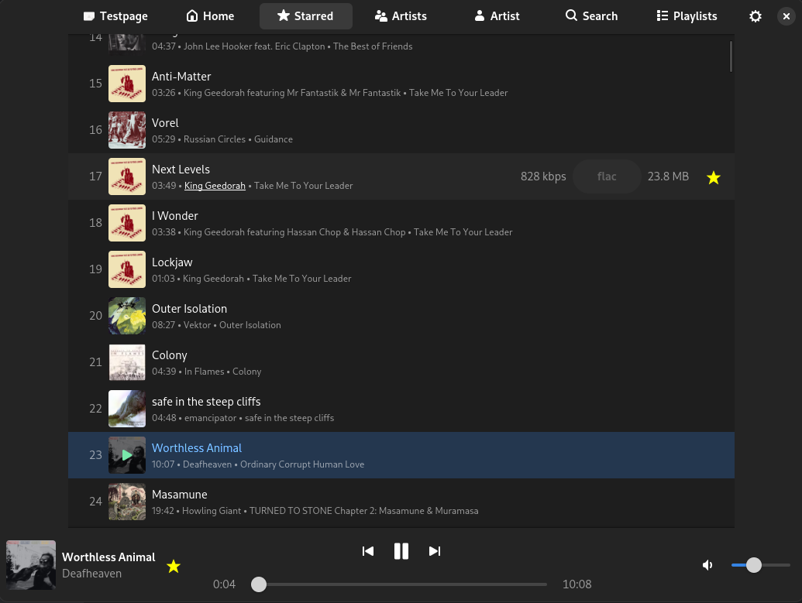

# subsound-gtk

Subsonic compatible player in GTK4 / Adwaita

Very early project still, but it works ok for basic playback and browsing.

### Screenshots

A few samples of what the UI looks like:

### TODO

- [X] songlist: duration, tracknumber, starred
- [X] songlist: bitrate, size, format
- [X] songlist: currently playing icon on the left
- [X] songlist: self-updating playing icon on the left
- [X] songlist: Single click to select, double-click/enter to activate (start playback)
- [X] songlist: Hover-shows-play ?
  - [ ] songlist: hover play icon is not tab-able for focus when row is selected, only when hover...
- [X] Starred page
  - [X] remove the track number
    - [X] Add list item number as the first element in the prefix field
  - [X] display artist
  - [X] make album art only load while in view (lazy list view)
  - [X] Fix play on row click + make focusable and double click to activate
  - [X] Fix keyboard navigation in the listview
  - [X] Fix focus on propagating to child of the ListItem in the listview (ActionRow does not get `focused` state when row is selected / focused)
  - [X] Make cover art be prettier in the ActionRow
  - [X] Fix blinking when hover/unhover
  - [ ] add a reload button or keep starred list up-to-date in the app at least
  - [X] goto artist when clicking artist name
  - [X] goto album when clicking album name
  - [ ] goto album when clicking on album artwork
    - [ ] add hover / glow / overlay icon when hovering over artwork?
  - [ ] display whole albums / artist that have been starred in addition to individual songs?
- [X] cache thumbnails on disk
  - [ ] use a Texture / Paintable instead ? pixbuf is deprecated it looks like
  - [X] switch load directly from cached file?
  - [X] reuse the pixbuf for albumart (in memory cache)
  - [X] make resize retain aspect ratio
- [X] cache mp3 variant on disk
  - [X] fix song cache storing with original suffix instead of transcode format suffix
    - This caused us to save mp3 transcoded flac data with .flac extension
  - [ ] find a way to handle difference between original and stream (transcoded) data better
- [X] replace gtk.image with gtk.picture? https://docs.gtk.org/gtk4/class.Picture.html
- [X] PlayerBar: title/album
- [X] PlayerBar: wire up now-playing to playerState
- [X] PlayerBar: CoverArt
- [X] PlayerBar: play/pause button
- [X] PlayerBar: find icons for buttons
  - [X] PlayerBar: Playing ProgressBar
  - [X] make play/pause icon slightly bigger than the others
  - [X] add star button to star/unstar currently playing song
  - [X] model loading state
    - [X] show loading progress in player seek bar 
    - [ ] show loading state as a overlay icon and switch to paused?
  - [ ] add rating button to the right?
  - [X] goto artist when clicking artist name
  - [ ] goto album when clicking on album artwork
- [X] Icons for top bar pages
    - [X] icon for Home page
    - [X] icon for starred page
- HomePage
  - [X] Newly added: https://subsonic.org/pages/api.jsp#getAlbumList2 type=newest
  - [X] recently played: https://subsonic.org/pages/api.jsp#getAlbumList2 type=recent
  - [X] Most played: https://subsonic.org/pages/api.jsp#getAlbumList2 type=frequent
  - [ ] https://subsonic.org/pages/api.jsp#getTopSongs
  - [ ] https://subsonic.org/pages/api.jsp#getSimilarSongs2
- ArtistListing:
  - [X] add a circular artist thumbnail in the left prefix area
  - [ ] convert to using a ~AdwLeaflet~ `AdwNavigationSplitView`
  - [ ] model loading state when switching selected artist
- Make ArtistInfo page coverart prettier with:
  - [X] better design
    - [ ] Find a reasonable way to include the artistinfo text, without making it so dominant
  - [ ] a blurred paintable background ?
    - Something like: https://github.com/neithern/g4music/blob/master/src/ui/paintables.vala#L357
- Make AlbumView page prettier with:
  - [ ] better design
  - [ ] a blurred paintable background ?
    - BlurHash / ThumbHash / dominant color gradient / 
- [X] Make downloading song async
- [X] PlayQueue: implement a in-memory play queue
  - [X] PlayQueue: auto playback of next queue item
  - [X] PlayQueue: prev with position >= 4.0 seconds played means seekToStart
  - [ ] PlayQueue: enqueue a song that will be added after the current playing song in the playqueue
  - [ ] PlayQueue: Gapless playback of queue using gstreamer soon-finished signal / message + setting next-uri property
- Proper navigation
  - [ ] fix the navigationview
  - [ ] fix back button in headerbar
  - AdwNavigationView ?
  - AdwLeaflet + AdwClamp? see https://gitlab.gnome.org/GNOME/gnome-music/-/blob/master/data/ui/ArtistAlbumsWidget.ui
- [ ] set up a sqlite database with migrations
  - perhaps there is a good android library for migrating sqlite ?
  - [ ] record what we have downloaded / want to keep offline
- Onboarding
  - [ ] Detect we are first launch / have no configuration to load
  - [ ] Send to Configuration Page on first launch
- Configuration Page
  - [X] Create a page
  - [X] Edit basic server settings
  - [X] Read configuration from file
  - [X] Save configuration to file
  - [X] Toast on success / failure
  - [X] "Test mode" for client
  - [X] Update the ServerClient configuration dynamically when configuration is saved, and reflect it in the entire app
  - [ ] extend to custom server specific settings, such as transcode format and bitrate
  - [ ] support for tlsNoVerify
- [X] Create a persistent store for server settings / authentication
  - [ ] store authentication in platform password storage / libsecret ?
- [X] Implement star/unstar
  - [ ] Optimistically update the local copy of Starred list based on star / unstar actions
- [ ] Playlist support
  - [ ] move Starred as a fake playlist under the playlists view ?
  - browsing playlists
  - add song to playlist
  - remove song from playlist
  - play as playqueue
- [ ] Mpris support
    - https://github.com/NGMusic/mpris-java/blob/master/extensions/src/xerus/mpris/AbstractMPRISPlayer.kt
    - https://github.com/NGMusic/moodplayer/blob/master/src/desktop/java/xerus/mpris/MPRIS.kt
    - https://github.com/NGMusic/mpris-java/blob/master/extensions/test/xerus/mpris/MPRISPlayer.kt
    - https://github.com/NGMusic/mpris-java/blob/master/src/main/org/mpris/MediaPlayer2/DBusPlayer.kt
    - [ ] thumbnail
    - [ ] play/pause
    - [ ] skip

Features:
- [X] Local music cache
- [X] Local artwork cache
- [X] Transcoding music
- [ ] Metadata cache / offline storage for song/artist metadata
- [ ] Download manager for offline available content
- [ ] Onboarding UI
- [X] Configuration UI
- [ ] Scrobble plays
- [X] Starred listing
- [X] Browse albums
- [X] Browse artists
- [X] Plays any track!

Later goals:
 - [ ] support multiple server types (native Navidrome API, Jellyfish etc)
 - [ ] support the subsonic podcast features
 - [ ] support embedded image tags? https://github.com/neithern/g4music/blob/bf80b5cad448a57c635f01d0a315671fef045d14/src/gst/tag-parser.vala#L99

Non-goals:
 - Video support  
 - Jukebox support

Possible ideas:
  - Shared remote control, think something like Spotify Connect
  - Could support chromecast
  - Player for local media, not just for a streaming server

My notes:

Adw CSS classes: https://gnome.pages.gitlab.gnome.org/libadwaita/doc/main/style-classes.html
https://docs.gtk.org/gtk4/css-properties.html
https://docs.gtk.org/gtk4/css-overview.html

AdwNavigationView:
https://gnome.pages.gitlab.gnome.org/libadwaita/doc/main/class.NavigationView.html
- push / pop AdwNavigationPage

AdwLeaflet:
https://gnome.pages.gitlab.gnome.org/libadwaita/doc/main/class.Leaflet.html

AdwClamp:
https://gnome.pages.gitlab.gnome.org/libadwaita/doc/main/class.Clamp.html

List Widget Overview
https://docs.gtk.org/gtk4/section-list-widget.html

Scalable lists in GTK 4
https://blog.gtk.org/2020/06/07/scalable-lists-in-gtk-4/

Named colors in
https://gnome.pages.gitlab.gnome.org/libadwaita/doc/main/named-colors.html#palette-colors

Adwaita available style classes stylesheet
https://gnome.pages.gitlab.gnome.org/libadwaita/doc/main/style-classes.html

