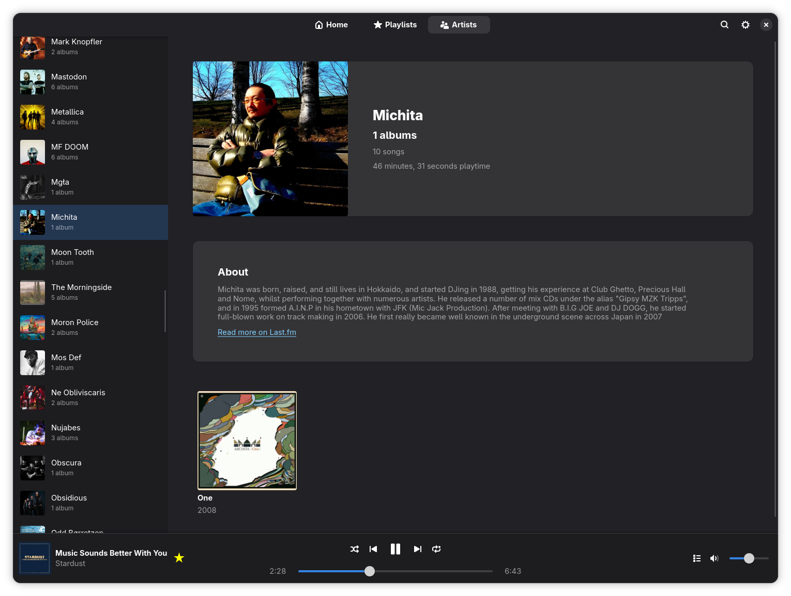

# Subsound

Subsonic compatible player in GTK4 / Adwaita

Best used with [Navidrome](https://github.com/navidrome/navidrome).

[](https://flathub.org/apps/io.github.subsoundorg.Subsound)

[](https://stopthemingmy.app)

Install from Flathub:

```bash
# Install
$ flatpak install io.github.subsoundorg.Subsound
```

## Screenshots

A few samples of what the UI looks like:




## Installation

Install from Flathub:

```bash
# Install
flatpak install io.github.subsoundorg.Subsound

# Run
flatpak run io.github.subsoundorg.Subsound

# Update
flatpak update io.github.subsoundorg.Subsound
```

### Beta releases

We also have a beta release available on the subsound-gtk-repo repo 
where we push most builds before they are released to Flathub.

```bash
# Add remote (one-time)
flatpak remote-add --user --no-gpg-verify subsound-beta https://subsoundorg.github.io/subsound-gtk-repo/

# Install
flatpak install --user subsound-beta io.github.subsoundorg.Subsound

# Run
flatpak run --user io.github.subsoundorg.Subsound

# Update
flatpak update --user io.github.subsoundorg.Subsound
```

## Features

Features:
- [X] Local music cache
- [X] Local artwork cache
- [X] Transcoding music
- [X] Onboarding UI
- [X] Configuration UI
- [X] Starred listing
- [X] Browse albums
- [X] Browse artists
- [X] Fast Search UI with ctrl+k
- [X] MPRIS support
- [X] Internationalize (support is started, missing translations)
- [X] Lyrics support
- [X] Offline mode
  - [X] Force Offline/Online mode
  - [X] Offline mode detection/tracking
  - [X] Download songs to local cache
  - [X] Play songs from local cache
  - [X] Download album art to local cache
  - [X] Sync artist/song metadata for offline storage
  - [X] Playlists
  - [X] Scrobble offline, send later
  - [X] Browse from offline storage only
  - [ ] Search from offline storage only or disable search box
  - [X] Download manager for offline available content
    - This kind of already works, but there is no UI that shows status for each item

Later goals:
- [ ] Offline lyrics

Potential goals:
 - [ ] support multiple server types (native Navidrome API, OpenSubsonic, Jellyfish etc)
 - [ ] make it look OK in light mode?
 - [ ] Chromecast support
 - [ ] support the subsonic podcast features
 - [ ] consider using fanart.tv
 - [ ] support embedded image tags? https://github.com/neithern/g4music/blob/bf80b5cad448a57c635f01d0a315671fef045d14/src/gst/tag-parser.vala#L99

Non-goals:
 - Video support  
 - Jukebox support

Possible ideas:
  - Shared remote control, think something like Spotify Connect
  - Chromecast support
  - Player for local media, not just for a streaming server

## Translations

Subsound uses gettext (`.po` files), the standard translation mechanism for GTK4/GNOME apps.
User-visible strings are marked in the Java code with `tr(...)` / `trn(...)` / `trc(...)`
from `org.subsound.i18n.I18n`, extracted into `po/io.github.subsoundorg.Subsound.pot`,
and translated per-language in `po/<lang>.po`.

**English needs no translation file.** In gettext the `msgid` *is* the English source
text, not an abstract key like `settings.title`. So `tr("Settings")` returns the literal
`"Settings"` unless a catalog for the active locale translates it — there is nothing to
"fall back" to, because the English string is already embedded in the code. This has a
few practical consequences:

- **No missing-key failure mode.** A brand-new string works immediately in English, even
  before the catalogs are updated. Untranslated or stale entries in other languages also
  just show English rather than a placeholder key.
- **English edits invalidate translations.** Rewording an English string changes its
  msgid — `msgmerge` marks the old translation as fuzzy (near matches) or drops it.
  That is intended: the translation genuinely needs review after the source changed.
- **English variants are still possible.** An `en_GB.po` ("Favourites") can be added
  like any other language.
- The one exception is `tr("translator-credits")` in the About dialog — a magic msgid
  that AdwAboutDialog recognizes: if it comes back untranslated the credits section is
  hidden, and each language's `.po` fills in its own translators' names.

To add or update a language:

```bash
# Add the language code to po/LINGUAS (one per line), then:
./po/update-po.sh          # regenerate the .pot template and merge into all .po files

# Translate the msgstr entries in po/<lang>.po, then verify and build:
./gradlew compileMessages  # runs msgfmt --check and compiles to build/locale/

# Try it:
LANGUAGE=<lang> ./gradlew run
```

## Credits

Vectors and icons by <a href="https://www.svgrepo.com" target="_blank">SVG Repo</a>
